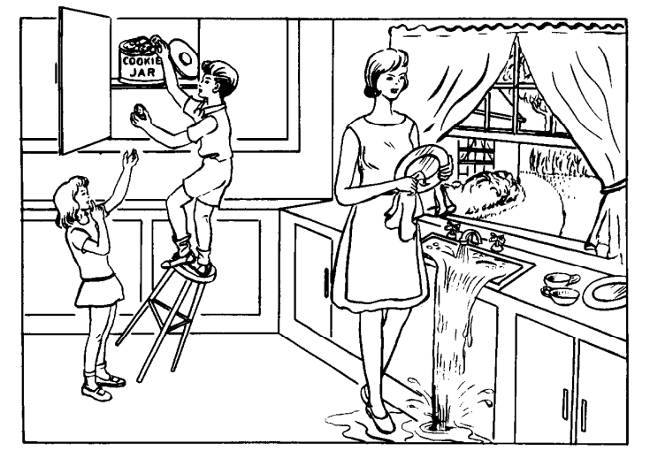

# HSAF-DWAN

Hybrid Self-Aligned Fusion with Dual-Weight Attention Network for Alzheimer’s Detection

## Overview

Dementia, particularly Alzheimer’s disease (AD), affects millions of elderly individuals worldwide. This project introduces **HSAF-DWAN** – a novel multimodal architecture aimed at improving the automatic detection of Alzheimer’s disease by leveraging audio recordings, transcripts, and attention-weighted images.

The core innovation of HSAF-DWAN lies in its ability to integrate diverse data modalities through specialized modules, enhancing the model's capability to detect AD-related patterns with increased accuracy and reliability.

## Cookie Theft Task
In the "Cookie Theft" task, participants are shown a picture depicting a detailed scene: a boy reaching for cookies from a jar, a woman cleaning plates, a sink brimming over with water, and a kitchen filled with various household items, such as dishes, food, and possibly an open window. Participants were asked to describe the picture as much as possible. The "Cookie Theft" picture is as follows:

## Key Contributions

1. **Attention-Weighted Image Set**: Integrates text-image relevance with key visual areas from the Cookie Theft picture.
2. HSAF-DWAN Architecture:
   - **IMSA Module**: Aligns intra-modality relationships.
   - **DW-CMA Module**: Fuses multimodal data through dual-weight cross-attention.

## Repository Structure

`data/`: Dataset with audio, text, and images.

The dataset includes three main components:

- **Text and Audio**: The original transcripts and audio recordings used for this project can be requested from [TalkBank](https://talkbank.org/). Follow their guidelines to obtain access to the data.
- **Images**: The `img/` folder in this repository contains the attention-weighted images, which have been recolored to emphasize specific regions based on descriptions related to Alzheimer’s disease detection tasks.

`models/`: models

`results/`: Evaluation metrics and outputs.
